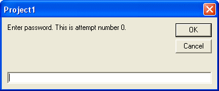

<div align="center">

## \[ Password Protection With Up To 3 Attemps \]


</div>

### Description

This will ask the user to enter a password and if it is incorrect it will give them two more chances (three attempts in total). Please vote and leave comments :)
 
### More Info
 
One Command Button name Command1.


<span>             |<span>
---                |---
**Submitted On**   |
**By**             |[JamesJD](https://github.com/Planet-Source-Code/PSCIndex/blob/master/ByAuthor/jamesjd.md)
**Level**          |Beginner
**User Rating**    |4.0 (40 globes from 10 users)
**Compatibility**  |VB 3\.0, VB 4\.0 \(16\-bit\), VB 4\.0 \(32\-bit\), VB 5\.0, VB 6\.0
**Category**       |[Miscellaneous](https://github.com/Planet-Source-Code/PSCIndex/blob/master/ByCategory/miscellaneous__1-1.md)
**World**          |[Visual Basic](https://github.com/Planet-Source-Code/PSCIndex/blob/master/ByWorld/visual-basic.md)
**Archive File**   |[](https://github.com/Planet-Source-Code/jamesjd-password-protection-with-up-to-3-attemps__1-48382/archive/master.zip)


### Source Code

```
Private Sub Command1_Click()
  Dim Password As String
  Dim InputPassword As String
  Dim Attempt As Integer
  Password = "Secret"
  Attempt = 0
  Do
    InputPassword = InputBox("Enter password. This is attempt number " & Attempt & ".")
    Attempt = Attempt + 1
  Loop Until (Attempt = 3) Or (InputPassword = Password)
  If InputPassword = Password Then
    MsgBox ("This password is valid!")
  Else
    MsgBox ("This password is invalid!")
  End If
End Sub
```

